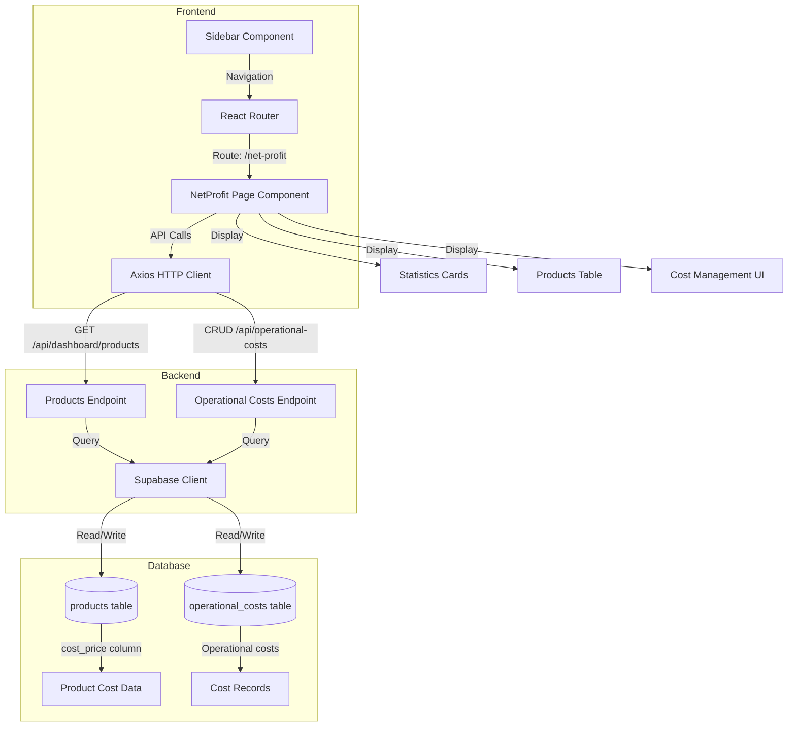
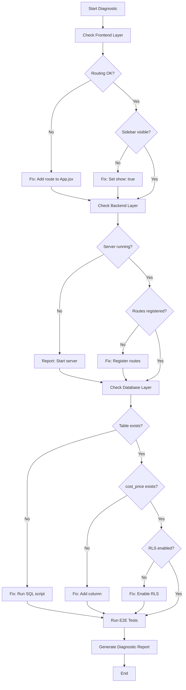

# Design Document: NetProfit Page Diagnostic and Fix

## Overview

This design document outlines a systematic diagnostic and repair workflow for the NetProfit page issue. The user reports "صفحة صافي الربح مش شغالة خالص" (NetProfit page not working at all). The system will implement a three-phase approach:

1. **Phase 1: Diagnostic Checks** - Automated verification of all system components
2. **Phase 2: Automated Fixes** - Apply repairs based on diagnostic findings
3. **Phase 3: Verification** - End-to-end testing of all features

The diagnostic system will check frontend routing, backend API endpoints, database schema, and data flow to identify the root cause. Once identified, automated fixes will be applied, followed by comprehensive verification testing.

### Design Goals

- Provide a systematic, repeatable diagnostic process
- Minimize manual intervention through automation
- Generate clear, actionable diagnostic reports in Arabic for users
- Ensure all NetProfit page features work correctly after fixes
- Maintain data integrity throughout the repair process

### Key Features

- Automated diagnostic script that checks all system layers
- Database schema verification and repair
- Backend API endpoint validation
- Frontend component and routing verification
- End-to-end functional testing
- Bilingual reporting (Arabic for users, English for technical details)

## Architecture

### System Layers

The NetProfit page functionality spans three architectural layers:



### Diagnostic Flow



### Component Interaction

The NetProfit page interacts with multiple system components:

1. **Authentication Layer**: JWT token validation for all API requests
2. **Data Layer**: Products and operational costs data from Supabase
3. **Calculation Layer**: Client-side statistics calculation
4. **UI Layer**: React components for display and interaction

## Components and Interfaces

### Frontend Components

#### 1. NetProfit Page Component (`frontend/src/pages/NetProfit.jsx`)

**Responsibilities:**

- Fetch products and operational costs data on mount
- Calculate statistics (revenue, costs, profit, margin)
- Display statistics cards
- Render products table with cost management
- Handle cost price editing
- Manage operational costs CRUD operations

**State Management:**

```typescript
interface NetProfitState {
  products: Product[];
  operationalCosts: OperationalCost[];
  loading: boolean;
  message: { type: "success" | "error"; text: string };
  editingProduct: string | null;
  costPrice: string;
  searchTerm: string;
  stats: Statistics;
  showCostModal: boolean;
  selectedProduct: string | null;
  newCost: NewCostForm;
}

interface Statistics {
  totalRevenue: number;
  totalCost: number;
  totalOperationalCosts: number;
  grossProfit: number;
  netProfit: number;
  avgProfitMargin: number;
}
```

**API Calls:**

- `GET /api/dashboard/products` - Fetch products with cost_price
- `GET /api/operational-costs` - Fetch operational costs
- `PUT /api/dashboard/products/:id` - Update product cost_price
- `POST /api/operational-costs` - Create operational cost
- `DELETE /api/operational-costs/:id` - Delete operational cost

#### 2. Sidebar Component (`frontend/src/components/Sidebar.jsx`)

**Responsibilities:**

- Display navigation menu
- Show "صافي الربح" menu item with TrendingUp icon
- Handle navigation to `/net-profit` route

**Configuration:**

```javascript
{
  icon: TrendingUp,
  label: "صافي الربح",
  path: "/net-profit",
  show: true  // Must be true for visibility
}
```

#### 3. React Router Configuration (`frontend/src/App.jsx`)

**Required Route:**

```jsx
<Route
  path="/net-profit"
  element={
    <ProtectedRoute>
      <NetProfit />
    </ProtectedRoute>
  }
/>
```

### Backend Components

#### 1. Operational Costs Routes (`backend/src/routes/operationalCosts.js`)

**Endpoints:**

```javascript
// GET /api/operational-costs
// Returns: Array of operational costs with product relationship
// Query params: product_id (optional)
// Auth: Required (JWT)

// GET /api/operational-costs/:id
// Returns: Single operational cost with product details
// Auth: Required (JWT)

// POST /api/operational-costs
// Body: { product_id, cost_name, cost_type, amount, apply_to, description }
// Returns: Created operational cost
// Auth: Required (JWT)

// PUT /api/operational-costs/:id
// Body: Partial operational cost fields
// Returns: Updated operational cost
// Auth: Required (JWT)

// DELETE /api/operational-costs/:id
// Returns: Success message
// Auth: Required (JWT)
```

**Authentication Middleware:**

```javascript
const authenticateToken = (req, res, next) => {
  const token = req.headers.authorization?.split(" ")[1];
  if (!token) return res.status(401).json({ error: "غير مصرح" });

  jwt.verify(token, process.env.JWT_SECRET, (err, user) => {
    if (err) return res.status(403).json({ error: "توكن غير صالح" });
    req.user = user;
    next();
  });
};
```

#### 2. Products Endpoint (`/api/dashboard/products`)

**Requirements:**

- Must return products array with `cost_price` field
- Must handle authentication
- Must filter by user_id
- Response format: `Array<Product>` or `{ data: Array<Product> }`

#### 3. Server Configuration (`backend/src/server.js`)

**Required Route Registration:**

```javascript
import operationalCostsRoutes from "./routes/operationalCosts.js";
app.use("/api/operational-costs", operationalCostsRoutes);
```

### Diagnostic Script Component

#### DiagnosticRunner (New Component)

**Purpose:** Automated system verification

**Checks to Perform:**

1. **Frontend Checks:**
   - Verify Sidebar menu item exists with `show: true`
   - Verify React Router has `/net-profit` route
   - Verify NetProfit component is imported
   - Verify ProtectedRoute wrapper is present

2. **Backend Checks:**
   - Verify server is running (health check endpoint)
   - Verify `/api/operational-costs` route is registered
   - Verify `/api/dashboard/products` returns cost_price field
   - Test authentication with valid token

3. **Database Checks:**
   - Verify `operational_costs` table exists
   - Verify `products.cost_price` column exists
   - Verify RLS policies are enabled
   - Verify `calculate_order_net_profit` function exists
   - Test basic CRUD operations

**Output Format:**

```typescript
interface DiagnosticReport {
  timestamp: string;
  checks: DiagnosticCheck[];
  fixes: Fix[];
  manualSteps: ManualStep[];
  summary: {
    totalChecks: number;
    passed: number;
    failed: number;
    fixed: number;
  };
}

interface DiagnosticCheck {
  category: "frontend" | "backend" | "database";
  name: string;
  status: "PASS" | "FAIL";
  details: string;
  error?: string;
}

interface Fix {
  check: string;
  action: string;
  status: "applied" | "failed" | "manual_required";
  before: string;
  after: string;
}

interface ManualStep {
  step: number;
  description_ar: string;
  description_en: string;
  command?: string;
  file?: string;
}
```

## Data Models

### Database Schema

#### operational_costs Table

```sql
CREATE TABLE operational_costs (
  id UUID PRIMARY KEY DEFAULT uuid_generate_v4(),
  user_id UUID NOT NULL REFERENCES users(id) ON DELETE CASCADE,
  product_id UUID REFERENCES products(id) ON DELETE CASCADE,

  -- Cost details
  cost_name VARCHAR(255) NOT NULL,
  cost_type VARCHAR(50) NOT NULL, -- 'ads', 'operations', 'shipping', 'packaging', 'other'
  amount DECIMAL(10, 2) NOT NULL DEFAULT 0,

  -- Application
  apply_to VARCHAR(50) NOT NULL DEFAULT 'per_unit', -- 'per_unit', 'per_order', 'fixed'

  -- Metadata
  description TEXT,
  is_active BOOLEAN DEFAULT true,
  created_at TIMESTAMP WITH TIME ZONE DEFAULT NOW(),
  updated_at TIMESTAMP WITH TIME ZONE DEFAULT NOW()
);
```

**Indexes:**

- `idx_operational_costs_user` on `user_id`
- `idx_operational_costs_product` on `product_id`
- `idx_operational_costs_type` on `cost_type`
- `idx_operational_costs_active` on `is_active`

**RLS Policies:**

- Users can view their own operational costs
- Users can insert their own operational costs
- Users can update their own operational costs
- Users can delete their own operational costs

#### products Table Extension

**Required Column:**

```sql
ALTER TABLE products
ADD COLUMN IF NOT EXISTS cost_price DECIMAL(10, 2) DEFAULT 0;
```

### API Data Models

#### Product Model

```typescript
interface Product {
  id: string;
  user_id: string;
  shopify_id: string;
  title: string;
  price: number;
  cost_price: number; // Required for NetProfit calculations
  image: string;
  inventory_quantity: number;
  created_at: string;
  updated_at: string;
}
```

#### Operational Cost Model

```typescript
interface OperationalCost {
  id: string;
  user_id: string;
  product_id: string | null;
  cost_name: string;
  cost_type: "ads" | "operations" | "shipping" | "packaging" | "other";
  amount: number;
  apply_to: "per_unit" | "per_order" | "fixed";
  description: string | null;
  is_active: boolean;
  created_at: string;
  updated_at: string;
  product?: {
    id: string;
    title: string;
    image_url: string;
  };
}
```

### Calculation Models

#### Statistics Calculation

```typescript
// For each product:
const productRevenue = product.price;
const productCost = product.cost_price || 0;
const productOpCosts = operationalCosts
  .filter(oc => oc.product_id === product.id && oc.is_active)
  .reduce((sum, oc) => sum + oc.amount, 0);

const grossProfit = productRevenue - productCost;
const netProfit = grossProfit - productOpCosts;
const profitMargin = productRevenue > 0
  ? (netProfit / productRevenue) * 100
  : 0;

// Aggregated statistics:
const stats = {
  totalRevenue: sum(products.map(p => p.price)),
  totalCost: sum(products.map(p => p.cost_price || 0)),
  totalOperationalCosts: sum(all active operational costs),
  grossProfit: totalRevenue - totalCost,
  netProfit: grossProfit - totalOperationalCosts,
  avgProfitMargin: average(products.map(p => calculateMargin(p)))
};
```

## Correctness Properties

_A property is a characteristic or behavior that should hold true across all valid executions of a system—essentially, a formal statement about what the system should do. Properties serve as the bridge between human-readable specifications and machine-verifiable correctness guarantees._

### Property Reflection

After analyzing all acceptance criteria, I identified the following testable properties. Several criteria were combined or eliminated to avoid redundancy:

**Redundancy Analysis:**

- Requirements 3.5, 6.2, 6.4, and 9.2 all test API response structure and field presence. These are combined into Properties 1-3 to avoid duplication.
- Requirements 6.5, 9.4, 9.6, and 9.7 all test round-trip persistence. These are combined into Property 4 (round-trip property).
- Requirements 4.5 and 7.5 both test error message display. Combined into Property 5.
- Requirements 7.4, 7.6, and 9.2 all test calculation correctness. Combined into Property 6.
- Edge cases (4.6, 7.1, 7.2, 7.7) are handled by generators in property tests rather than separate properties.

### Property 1: Products API Response Structure

_For any_ valid authenticated request to `/api/dashboard/products`, the response SHALL be an array or object with data property, and each product SHALL include all required fields: id, title, price, cost_price, and image.

**Validates: Requirements 3.5, 6.2**

### Property 2: Operational Costs API Response Structure

_For any_ valid authenticated request to `/api/operational-costs`, the response SHALL be an array, and each operational cost SHALL include product relationship data when product_id is not null.

**Validates: Requirements 6.4**

### Property 3: Authentication Error Handling

_For any_ request to `/api/operational-costs` with invalid or missing authentication token, the endpoint SHALL return HTTP status code 401.

**Validates: Requirements 6.3**

### Property 4: Data Persistence Round Trip

_For any_ valid data modification operation (cost_price update, operational cost creation, operational cost deletion), when the operation completes successfully, querying the same data SHALL reflect the modification.

**Validates: Requirements 6.5, 9.4, 9.6, 9.7**

### Property 5: Error Message Display

_For any_ API error response received by the NetProfit page, the component SHALL display an error message in Arabic to the user.

**Validates: Requirements 4.5, 7.5**

### Property 6: Statistics Calculation Correctness

_For any_ set of products and operational costs, the calculated statistics SHALL satisfy:

- totalRevenue = sum of all product prices
- totalCost = sum of all product cost_prices (treating null as 0)
- totalOperationalCosts = sum of all active operational costs
- netProfit = totalRevenue - totalCost - totalOperationalCosts
- All currency values SHALL be formatted with exactly 2 decimal places

**Validates: Requirements 7.4, 7.6, 9.2**

### Property 7: Products Table Display Completeness

_For any_ product in the products array, the products table SHALL display all required fields: price, cost_price, operational costs sum, net profit, and profit margin.

**Validates: Requirements 9.2**

## Error Handling

### Frontend Error Handling

#### API Request Failures

**Strategy:** Graceful degradation with user feedback

```javascript
try {
  const response = await axios.get("/api/endpoint", { headers });
  // Process response
} catch (err) {
  console.error("Error details:", err);
  setMessage({
    type: "error",
    text: err.response?.data?.error || "فشل تحميل البيانات",
  });
}
```

**Error Categories:**

1. **Network Errors** - Display: "فشل الاتصال بالخادم"
2. **Authentication Errors (401/403)** - Redirect to login
3. **Not Found Errors (404)** - Display: "البيانات غير موجودة"
4. **Server Errors (500)** - Display: "خطأ في الخادم"
5. **Validation Errors (400)** - Display specific error from server

#### Empty Data Handling

**Products Array Empty:**

```javascript
{
  filteredProducts.length === 0 && (
    <div className="text-center py-12">
      <Package size={64} className="mx-auto text-gray-300 mb-4" />
      <p className="text-gray-500 text-lg">لا توجد منتجات</p>
    </div>
  );
}
```

**Operational Costs Empty:**

- Display $0.00 for operational costs column
- Show "إضافة تكلفة" button to add first cost

#### Null/Undefined Value Handling

**Cost Price:**

```javascript
const cost = parseFloat(product.cost_price) || 0;
```

**Operational Costs:**

```javascript
const opCosts = operationalCosts
  .filter((oc) => oc.product_id === product.id && oc.is_active)
  .reduce((sum, oc) => sum + parseFloat(oc.amount || 0), 0);
```

#### Loading States

```javascript
if (loading) {
  return (
    <div className="flex h-screen bg-gray-100">
      <Sidebar />
      <main className="flex-1 overflow-auto p-8">
        <div className="text-center">جاري التحميل...</div>
      </main>
    </div>
  );
}
```

### Backend Error Handling

#### Authentication Errors

```javascript
const authenticateToken = (req, res, next) => {
  const token = req.headers.authorization?.split(" ")[1];
  if (!token) {
    return res.status(401).json({ error: "غير مصرح" });
  }

  jwt.verify(token, process.env.JWT_SECRET, (err, user) => {
    if (err) {
      return res.status(403).json({ error: "توكن غير صالح" });
    }
    req.user = user;
    next();
  });
};
```

#### Validation Errors

```javascript
if (!cost_name || !cost_type || amount === undefined) {
  return res.status(400).json({ error: "البيانات المطلوبة مفقودة" });
}
```

#### Database Errors

```javascript
try {
  const { data, error } = await supabase.from("table").select();
  if (error) throw error;
  res.json(data);
} catch (err) {
  console.error("Database error:", err);
  res.status(500).json({ error: "فشل تحميل البيانات" });
}
```

#### User ID Consistency

**Problem:** Different JWT payloads may use `id` or `userId`

**Solution:** Consistent extraction pattern

```javascript
const userId = req.user.id || req.user.userId;
```

### Database Error Handling

#### RLS Policy Violations

**Symptom:** Queries return empty results or permission denied

**Solution:** Ensure all queries filter by user_id matching authenticated user

```sql
-- Correct pattern
SELECT * FROM operational_costs
WHERE user_id = auth.uid();
```

#### Missing Foreign Key References

**Symptom:** Insert fails with foreign key constraint violation

**Solution:** Validate product_id exists before creating operational cost

```javascript
// Optional: Verify product exists
const { data: product } = await supabase
  .from("products")
  .select("id")
  .eq("id", product_id)
  .eq("user_id", userId)
  .single();

if (!product) {
  return res.status(404).json({ error: "المنتج غير موجود" });
}
```

### Diagnostic Error Handling

#### Check Failures

**Strategy:** Continue diagnostic even if individual checks fail

```javascript
const checks = [];

try {
  // Check 1
  const result1 = await performCheck1();
  checks.push({ name: "Check 1", status: "PASS", details: result1 });
} catch (err) {
  checks.push({
    name: "Check 1",
    status: "FAIL",
    details: "Failed",
    error: err.message,
  });
}

// Continue with remaining checks...
```

#### Fix Application Failures

**Strategy:** Report which fixes succeeded and which failed

```javascript
const fixes = [];

try {
  await applyFix1();
  fixes.push({
    check: "Check 1",
    action: "Applied fix",
    status: "applied",
  });
} catch (err) {
  fixes.push({
    check: "Check 1",
    action: "Fix failed",
    status: "failed",
    error: err.message,
  });
}
```

## Testing Strategy

### Dual Testing Approach

This feature requires both unit testing and property-based testing to ensure comprehensive coverage:

- **Unit Tests**: Verify specific examples, edge cases, and error conditions
- **Property Tests**: Verify universal properties across all inputs

Both testing approaches are complementary and necessary. Unit tests catch concrete bugs in specific scenarios, while property tests verify general correctness across a wide range of inputs.

### Property-Based Testing

**Library Selection:**

- **JavaScript/Node.js**: Use `fast-check` library
- **Installation**: `npm install --save-dev fast-check`

**Configuration:**

- Minimum 100 iterations per property test (due to randomization)
- Each property test must reference its design document property
- Tag format: `// Feature: net-profit-page-diagnostic-fix, Property {number}: {property_text}`

**Property Test Examples:**

#### Property 1: Products API Response Structure

```javascript
// Feature: net-profit-page-diagnostic-fix, Property 1: Products API Response Structure
const fc = require("fast-check");

test("Products API returns correct structure for any valid request", async () => {
  await fc.assert(
    fc.asyncProperty(
      fc.string(), // Generate random user IDs
      async (userId) => {
        const token = generateValidToken(userId);
        const response = await request(app)
          .get("/api/dashboard/products")
          .set("Authorization", `Bearer ${token}`);

        // Verify response structure
        expect(response.status).toBe(200);
        const products = Array.isArray(response.body)
          ? response.body
          : response.body.data;

        expect(Array.isArray(products)).toBe(true);

        // Verify each product has required fields
        products.forEach((product) => {
          expect(product).toHaveProperty("id");
          expect(product).toHaveProperty("title");
          expect(product).toHaveProperty("price");
          expect(product).toHaveProperty("cost_price");
          expect(product).toHaveProperty("image");
        });
      },
    ),
    { numRuns: 100 },
  );
});
```

#### Property 4: Data Persistence Round Trip

```javascript
// Feature: net-profit-page-diagnostic-fix, Property 4: Data Persistence Round Trip
test("Cost price updates persist across read operations", async () => {
  await fc.assert(
    fc.asyncProperty(
      fc.string(), // product ID
      fc.float({ min: 0, max: 10000 }), // cost price
      async (productId, newCostPrice) => {
        const token = generateValidToken();

        // Update cost price
        await request(app)
          .put(`/api/dashboard/products/${productId}`)
          .set("Authorization", `Bearer ${token}`)
          .send({ cost_price: newCostPrice });

        // Read back
        const response = await request(app)
          .get(`/api/dashboard/products/${productId}`)
          .set("Authorization", `Bearer ${token}`);

        // Verify persistence
        expect(response.body.cost_price).toBeCloseTo(newCostPrice, 2);
      },
    ),
    { numRuns: 100 },
  );
});
```

#### Property 6: Statistics Calculation Correctness

```javascript
// Feature: net-profit-page-diagnostic-fix, Property 6: Statistics Calculation Correctness
test("Statistics calculations are correct for any product set", () => {
  fc.assert(
    fc.property(
      fc.array(
        fc.record({
          price: fc.float({ min: 0, max: 1000 }),
          cost_price: fc.option(fc.float({ min: 0, max: 1000 }), { nil: null }),
        }),
      ),
      fc.array(
        fc.record({
          amount: fc.float({ min: 0, max: 100 }),
          is_active: fc.boolean(),
        }),
      ),
      (products, operationalCosts) => {
        const stats = calculateStatistics(products, operationalCosts);

        // Verify calculations
        const expectedRevenue = products.reduce((sum, p) => sum + p.price, 0);
        const expectedCost = products.reduce(
          (sum, p) => sum + (p.cost_price || 0),
          0,
        );
        const expectedOpCosts = operationalCosts
          .filter((oc) => oc.is_active)
          .reduce((sum, oc) => sum + oc.amount, 0);

        expect(stats.totalRevenue).toBeCloseTo(expectedRevenue, 2);
        expect(stats.totalCost).toBeCloseTo(expectedCost, 2);
        expect(stats.totalOperationalCosts).toBeCloseTo(expectedOpCosts, 2);
        expect(stats.netProfit).toBeCloseTo(
          expectedRevenue - expectedCost - expectedOpCosts,
          2,
        );

        // Verify formatting (2 decimal places)
        expect(stats.totalRevenue.toFixed(2)).toMatch(/^\d+\.\d{2}$/);
      },
    ),
    { numRuns: 100 },
  );
});
```

### Unit Testing

**Focus Areas:**

- Specific diagnostic checks (sidebar visibility, route configuration)
- Edge cases (empty arrays, null values)
- Error conditions (invalid tokens, missing data)
- UI interactions (button clicks, modal display)

**Unit Test Examples:**

#### Diagnostic Checks

```javascript
describe("Diagnostic System", () => {
  test("detects missing sidebar menu item", () => {
    const sidebarCode = readFileSync(
      "frontend/src/components/Sidebar.jsx",
      "utf8",
    );
    const hasNetProfitItem = sidebarCode.includes("صافي الربح");
    expect(hasNetProfitItem).toBe(true);
  });

  test("detects missing route configuration", () => {
    const appCode = readFileSync("frontend/src/App.jsx", "utf8");
    const hasNetProfitRoute = appCode.includes('path="/net-profit"');
    expect(hasNetProfitRoute).toBe(true);
  });

  test("verifies operational_costs table exists", async () => {
    const { data, error } = await supabase
      .from("operational_costs")
      .select("*")
      .limit(1);

    expect(error).toBeNull();
  });
});
```

#### Edge Cases

```javascript
describe("NetProfit Page Edge Cases", () => {
  test("handles empty products array", () => {
    const { container } = render(<NetProfit />);
    // Mock empty API response
    mockAxios.get.mockResolvedValueOnce({ data: [] });

    waitFor(() => {
      expect(container).toHaveTextContent("لا توجد منتجات");
    });
  });

  test("treats null cost_price as 0", () => {
    const product = { price: 100, cost_price: null };
    const profit = calculateProfit(product.price, product.cost_price, "id");
    expect(profit).toBe(100);
  });
});
```

#### Error Conditions

```javascript
describe("Error Handling", () => {
  test("displays Arabic error message on API failure", async () => {
    mockAxios.get.mockRejectedValueOnce(new Error("Network error"));

    const { container } = render(<NetProfit />);

    await waitFor(() => {
      expect(container).toHaveTextContent("فشل تحميل");
    });
  });

  test("returns 401 for missing authentication token", async () => {
    const response = await request(app).get("/api/operational-costs");

    expect(response.status).toBe(401);
    expect(response.body.error).toBe("غير مصرح");
  });
});
```

### Integration Testing

**End-to-End Test Scenarios:**

1. **Complete User Flow:**
   - Login as authenticated user
   - Navigate to NetProfit page from sidebar
   - Verify statistics cards display
   - Edit a product's cost price
   - Add an operational cost
   - Verify statistics update
   - Delete an operational cost
   - Verify statistics recalculate

2. **Diagnostic Flow:**
   - Run diagnostic script
   - Verify all checks execute
   - Apply fixes for any failures
   - Re-run diagnostic to verify fixes
   - Generate final report

**Tools:**

- **Frontend E2E**: Playwright or Cypress
- **Backend Integration**: Supertest
- **Database**: Test database with seed data

### Test Coverage Goals

- **Unit Tests**: 80%+ code coverage
- **Property Tests**: All 7 correctness properties implemented
- **Integration Tests**: All critical user flows covered
- **Diagnostic Tests**: All 10 requirements verified

### Continuous Testing

**Pre-commit Hooks:**

- Run unit tests
- Run linting and type checking

**CI/CD Pipeline:**

- Run all unit tests
- Run property tests (100 iterations each)
- Run integration tests
- Generate coverage report
- Fail build if coverage < 80%
